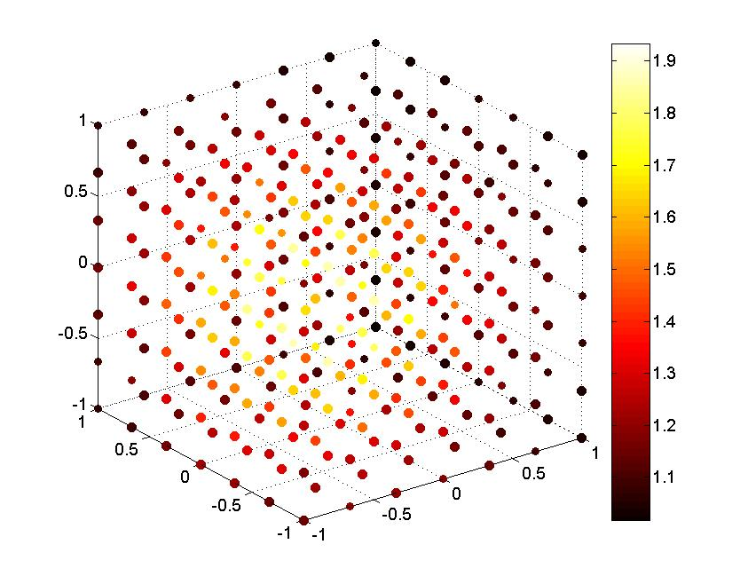

# LD3Ditp
3D polynomial interpolation on the nodes of degenerate 3D-Lissajous curves
--------------------------------------------------------------------------------

&nbsp;&nbsp;&nbsp;&nbsp;&nbsp;&nbsp;&nbsp;&nbsp;&nbsp; &nbsp;&nbsp; &nbsp;&nbsp;&nbsp;&nbsp;&nbsp;&nbsp;&nbsp;&nbsp;&nbsp; 

Version: 0.2 (01.07.2016)

Developed by <a href="http://www.math.uni-luebeck.de/mitarbeiter/dencker/index.php"> Peter Dencker</a> and 
<a href="http://www.lissajous.it"> Wolfgang Erb</a>

Description
-----------

The package LD3Ditp contains a Matlab and a Python implementation for 3D polynomial interpolation on 
the node points LD of degenerate 3D-Lissajous curves. 

The main test file for the interpolation are  
main_example.m and main_example.py

For plotting 3D degenerate Lissajous curves, the LD points as well as the index sets used in the 
polynomial interpolation use plot_Lissajous3D.m or plot_LD3D.py, respectively. 

 &nbsp;&nbsp;&nbsp; 

Citation and Credits
--------------------

The theory related to this package was developed by P. Dencker and W. Erb in

<ul>
<li> Dencker, P. and Erb, W.  
 <i> Multivariate polynomial interpolation on Lissajous-Chebyshev nodes </i>   
 J. Approx. Theory 219 (2017), 15-45 (<a href="http://arxiv.org/pdf/1511.04564">Preprint</a>) </li>
</ul>
    

The file plotregion.m in the Matlab package was written by Per Bergström 2006-01-16. In this package it is used as 
an auxiliary program in plot_Lissajous3D.m to plot the polygonal boundary of the index sets. 

License
-------

Copyright (C) 2016 by Peter Dencker and Wolfgang Erb

This package was developed by Peter Dencker and Wolfgang Erb 
at the Institute of Mathematics, University of Luebeck.

LD3Ditp is free software: you can redistribute it and/or modify
it under the terms of the GNU General Public License as published by
the Free Software Foundation, either version 3 of the License, or
(at your option) any later version.

This program is distributed in the hope that it will be useful,
but WITHOUT ANY WARRANTY; without even the implied warranty of
MERCHANTABILITY or FITNESS FOR A PARTICULAR PURPOSE.  See the
GNU General Public License for more details.

You should have received a copy of the GNU General Public License
along with this program. If not, see <http://www.gnu.org/licenses/>.
